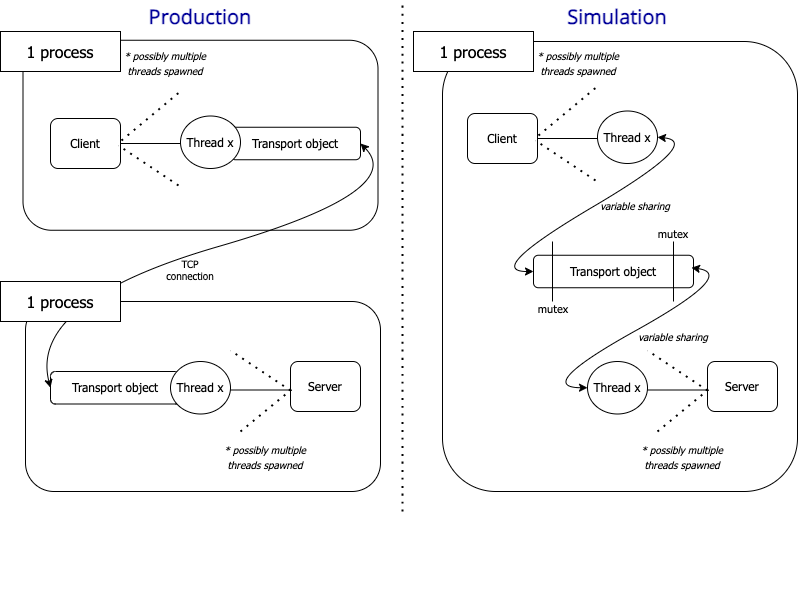

# Be-Tree
A simple, reference implementation of a B^e-tree

## Environments
There are 3 different environments to run the implementation:
* Production
* Simulation
* Testing

### Production Environment
The production environment is used on production. The RPC implementation of this envrionment uses eRPC. To be able to run on this environment, you need to build the eRPC, that is located under `third_party/eRPC` directory. 

**Ubuntu Prerequisites**
1. This implementation is tested and supported on Ubuntu OS. 
2. Install the necessary Ubuntu packages to be able to run the implementation
```
sudo apt install make
sudo apt install cmake
sudo apt install libssl-dev
sudo apt install libevent-dev
sudo apt install libboost-all-dev
sudo apt install libgtest-dev
sudo apt-get install libgflags-dev
sudo apt-get install libgoogle-glog-dev
sudo apt install g++
sudo apt-get install -y pkg-config
```

**Setup**
1. Setup and do the necessary installations of the Ubuntu environment as specified above
2. Build eRPC. For instructions to build eRPC, refer to the `third_party/eRPC` directory. 
2. Do `make` to compile and build the code
3. Do `./client/client` for the client machine to run the client code
4. Do `./server/server --configFile==<config file name> --serverIndex==<intended index of the server>`
    * An example configuration file is the file `config` in the root directory. In this configuration file, there are 2 servers spawned on the same machine, occupying 2 different ports. In this example file, 
        * Server index 0 indicates that this server instance will occupy the port 1234
        * Server index 1 indicates that this server instance will occupy the port 1235
5. Enter the file system operations from the client side as needed. 

### Simulation Environment
The simulation environment tries to simulate the production environment and hence is similar to the production environment. The interactivity and custom input ability of file system operations should be maintained for this environment. 

**Implementation Details**

The main difference between this environment and the production environment is that it does not use the eRPC library, it simulates the transportation of message between the client and the server using a 'simulated transportation'.

In the 'simulated transportation' implementation, there is a single transport object that is shared between the client and the server. Since the client and the server is actually located in the same runtime environment, the transport object is shared using variable sharing. 

The image below illustrates the difference between the production and simulation environment. 



In this environment, 
* the number of server threads
* the number of client threads
* all requests from all clients will always be directed to one of the server threads throughout the whole simulation. Hence, there is actually no need to spawn more than one server threads. 
* all requests from all clients will be handled one-by-one by that single server thread. Hence, it is not suitable for benchmarking.

**Ubuntu Prerequisites**

1. This implementation is tested and supported on Ubuntu OS. 
2. Install the necessary Ubuntu packages to be able to run the implementation
```
sudo apt install make
sudo apt install cmake
sudo apt install libssl-dev
sudo apt install libevent-dev
sudo apt install libboost-all-dev
sudo apt install libgtest-dev
sudo apt-get install libgflags-dev
sudo apt-get install libgoogle-glog-dev
sudo apt install g++
sudo apt-get install -y pkg-config
```

**Setup**

1. Do `make simulation` to compile and build the simulation code. 
2. Do `./simulation/simulation [--numClientThreadsSim=<number of client threads intended> --numServerThreadsSim=<number of server threads intended>` to run both the server and the client code.
    * You can optionally specify the number of server threads or number of client threads to be spawned in this simulation environment. If these are not specified, its value will be defaulted to 1.
3. Enter the file system operation as needed.

### Testing Environment 
The testing environment is for the purpose of testing the correctness of the implementation. There is no user input expected as the file system operations and its expected output has been defined beforehand.

This environment is not yet implemented at the moment.

## APIs
The APIs that are currently supported by the server are:
* `GetNodeId` 
    * This returns the ID of the node of the server applications in the server that it resides. A single server can have multiple sever applications